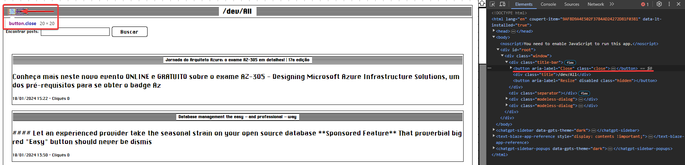

# Documentação dos Testes Realizados

Nesta documentação constam os resultados obtidos, seguindo a definição do plano de testes.

## 1 - Casos de Testes - Backend
1. Busca Textual por "JavaScript"

- Objetivo: Verificar se a busca textual por "JavaScript" retorna resultados ordenados pela data de publicação em ordem descendente.
- Pré-condições: Sistema em execução, banco de dados MySQL de leitura disponível.
- Descrição passo a passo: 

  - Enviar uma requisição GET para /post com o parâmetro de busca “JavaScript”.
  - Verificar se os resultados incluem posts relacionados a “JavaScript”.
  - Resultado esperado: Certificar-se de que os resultados estão ordenados pela data de publicação em ordem descendente.
  - [Endpoint utilizado](https://api.devall.com.br/api/v1/post?search=JavaScript)
- Status: ✅ 

2. Busca Textual por "Java"
- Objetivo: Confirmar se a busca textual por "Java" retorna resultados ordenados pela data de publicação em ordem descendente.
- Pré-condições: Sistema em execução, banco de dados MySQL de leitura disponível.
- Descrição passo a passo:

  - Enviar uma requisição GET para /post com o parâmetro de busca “Java”.
  - Verificar se os resultados incluem posts relacionados a “Java”.
  - Resultado esperado: Certificar-se de que os resultados estão ordenados pela data de publicação em ordem descendente.
  - [Endpoint utilizado](https://api.devall.com.br/api/v1/post?search=Java)
- Status: ✅

3. Registro de Clique (ID 6002)
- Objetivo: Assegurar que ao simular um clique em um post, a URL do post seja retornada corretamente.
- Pré-condições: Sistema em execução, banco de dados MySQL de leitura disponível.
- Descrição passo a passo:
  - Enviar uma requisição GET para /post/clique/6002.
  - Verificar se a URL do post é retornada corretamente.
  - Resultado esperado: O endpoint deve retornar a URL do post correspondente.
  - [Endpoint utilizado](https://api.devall.com.br/api/v1/post/clique/6002)
- Status: ✅

## 2 - Casos de Testes - Frontend

1. Carregamento Inicial
- Objetivo: Garantir que, ao abrir a aplicação, os últimos posts estejam sendo exibidas corretamente. 
- Pré-condições: Sistema em execução, conexão com o backend estabelecida.
- Descrição passo a passo:
  - Abrir a aplicação no navegador.
  - Verificar que os últimos posts estejam sendo exibidos corretamente.
  - Resultado esperado: A página inicial deve mostrar os últimos posts disponíveis.
- Status: ✅

2. Busca por Assunto
- Objetivo: Certificar-se de que a busca por assunto retorna resultados correspondentes ao termo inserido.
- Pré-condições: Sistema em execução, conexão com o backend estabelecida.
- Descrição passo a passo:
  - Digitar um termo de busca no formulário de pesquisa.
  - Enviar a pesquisa.
  - Verificar se os resultados da pesquisa correspondem ao termo inserido.
  - Resultado esperado: Certificar-se de que os resultados estão ordenados pela data de publicação em ordem descendente.
- Status: ✅

3. Redirecionamento para URL Externa
- Objetivo: Confirmar que, ao clicar em um post, o usuário é redirecionado para o site externo do post.
- Pré-condições: Sistema em execução, conexão com o backend estabelecida.
- Descrição passo a passo:
  - Clicar em um link de post na lista.
  - Verificar se o usuário é redirecionado para a URL externa do post.
  - Resultado esperado: O redirecionamento deve ser feito para a URL externa do post.
- Status: ✅

## Observações:
1. Botão sem Ação
- Objetivo: Verificar a existência e comportamento de um botão sem função atribuída.
- Pré-condições: Sistema em execução, conexão com o backend estabelecida.
- Descrição passo a passo:
  - Abrir a aplicação no navegador.
  - Verificar se ao clicar no botão disposto no canto superior esquerdo, tem-se alguma ação.
  - Resultado esperado: Certificar-se que o botão tenha uma ação válida.
- Status: ❌

Imagem para melhor compreensão:

